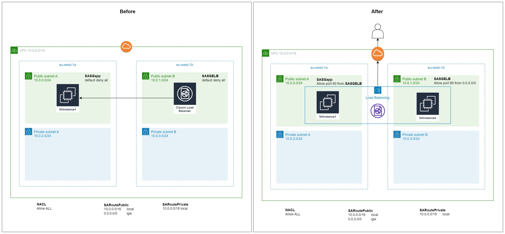
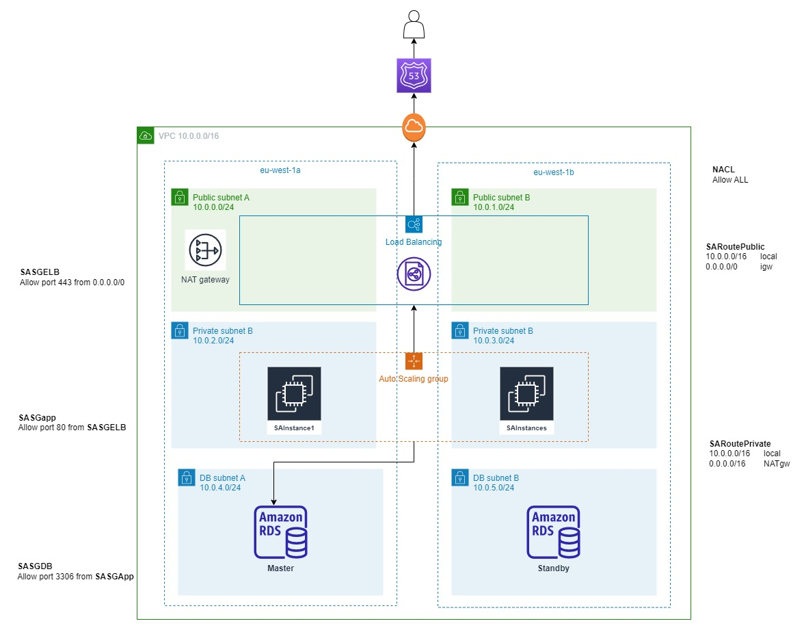
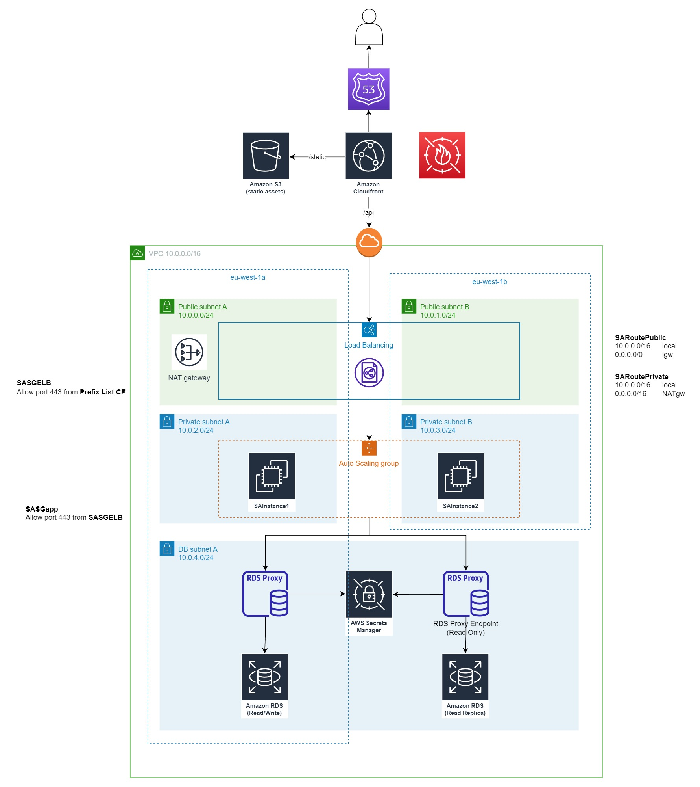

# SA Assignment : AWS Solution Proposal
Author: Thanet Sirichanyaphong

# Table of Contents
- [SA Assignment : AWS Solution Proposal](#sa-assignment--aws-solution-proposal)
- [Table of Contents](#table-of-contents)
- [Context](#context)
- [Solution](#solution)
  - [A. Troubleshooting](#a-troubleshooting)
    - [Architecture](#architecture)
    - [Explanation](#explanation)
  - [B. Short term solution](#b-short-term-solution)
    - [Architecture](#architecture-1)
    - [Explanation](#explanation-1)
  - [C. Long term solution](#c-long-term-solution)
    - [Architecture](#architecture-2)
    - [Explanation](#explanation-2)
- [References](#references)


# Context
My customer has no concrete AWS knowledge background and is encountering an issue when launching a web application as a proof of concept. Therefore they contact me seeking guidance the following issue. First, troubleshooting the current implementation to make the web application operational with minimum effort. Secondly, proposing a short term solution to improve the availability, security, reliability, cost and performance before the project goes live. Lastly, they want to have a long term solution plan to operate their website on a large scale.


# Solution

## A. Troubleshooting

### Architecture
- [Original Cloud Formation](AWS-SA-CloudFormation-v20190724.yaml)
- [Operational Cloud Formation](SA-Assignment-Thanet-Sirichanyaphong.yaml.yaml)



``` diff
@@ -148,12 +148,34 @@ Resources:
           DeviceIndex: 0
           SubnetId: !Ref 'PublicSubnetA'
           GroupSet: [!Ref 'SASGapp']
+
+    SAInstance2:
+      Type: AWS::EC2::Instance
+      Properties:
+        DisableApiTermination: 'false'
+        InstanceInitiatedShutdownBehavior: stop
+        ImageId: ami-047bb4163c506cd98
+        InstanceType: t2.micro
+        Monitoring: 'false'
+        UserData: IyEvYmluL2Jhc2gNCnl1bSB1cGRhdGUgLXkNCnl1bSBpbnN0YWxsIC15IGh0dHBkMjQNCnNlcnZpY2UgaHR0cGQgc3RhcnQNCmNoa2NvbmZpZyBodHRwZCBvbg0KZ3JvdXBhZGQgd3d3DQp1c2VybW9kIC1hIC1HIHd3dyBlYzItdXNlcg0KY2hvd24gLVIgcm9vdDp3d3cgL3Zhci93d3cNCmNobW9kIDI3NzUgL3Zhci93d3cNCmZpbmQgL3Zhci93d3cgLXR5cGUgZCAtZXhlYyBjaG1vZCAyNzc1IHt9ICsNCmZpbmQgL3Zhci93d3cgLXR5cGUgZiAtZXhlYyBjaG1vZCAwNjY0IHt9ICsNCmVjaG8gJzxodG1sPjxoZWFkPjx0aXRsZT5TdWNjZXNzITwvdGl0bGU+PC9oZWFkPjxib2R5PjxpZnJhbWUgd2lkdGg9IjU2MCIgaGVpZ2h0PSIzMTUiIHNyYz0iaHR0cHM6Ly93d3cueW91dHViZS5jb20vZW1iZWQvSnMyMXhLTUZkd3ciIGZyYW1lYm9yZGVyPSIwIiBhbGxvd2Z1bGxzY3JlZW4+PC9pZnJhbWU+PC9ib2R5PjwvaHRtbD4nID4gL3Zhci93d3cvaHRtbC9kZW1vLmh0bWw=
+        Tags:
+          - Key: environment
+            Value: sa-assignment
+          - Key: Name
+            Value: !Join ['-', [Instance2, !Ref 'CandidateName']]
+        NetworkInterfaces:
+        - AssociatePublicIpAddress: 'true'
+          DeleteOnTermination: 'true'
+          Description: Primary network interface
+          DeviceIndex: 0
+          SubnetId: !Ref 'PublicSubnetB'
+          GroupSet: [!Ref 'SASGapp']
           
     SAelb:
       Type: AWS::ElasticLoadBalancing::LoadBalancer
       Properties:
-        Subnets: [!Ref 'PublicSubnetB']
-        Instances: [!Ref 'SAInstance1']
+        Subnets: [!Ref 'PublicSubnetA', !Ref 'PublicSubnetB']
+        Instances: [!Ref 'SAInstance1', !Ref 'SAInstance2']
         SecurityGroups: [!Ref 'SASGELB']
         Listeners:
         - LoadBalancerPort: '80'
@@ -162,7 +184,7 @@ Resources:
         HealthCheck:
           HealthyThreshold: '2'
           Interval: '15'
-          Target: TCP:443
+          Target: HTTP:80/demo.html
           Timeout: '5'
           UnhealthyThreshold: '2'
         Tags:
@@ -176,6 +198,12 @@ Resources:
       Properties:
         GroupDescription: SA Assignment - ELB security group
         VpcId: !Ref 'SAVPC'
+        SecurityGroupIngress:
+          - IpProtocol: tcp
+            FromPort: 80
+            ToPort: 80
+            CidrIp: 0.0.0.0/0
+            Description: Accessible to http from any source
         Tags:
           - Key: environment
             Value: sa-assignment
@@ -187,6 +215,12 @@ Resources:
       Properties:
         GroupDescription: SA Assignment - App server security group
         VpcId: !Ref 'SAVPC'
+        SecurityGroupIngress:
+          - IpProtocol: tcp
+            FromPort: 80
+            ToPort: 80
+            SourceSecurityGroupId: !Ref SASGELB
+            Description: Accessible to http from ELB
         Tags:
           - Key: environment
             Value: sa-assignment
```

### Explanation
1. Validate the cloudformation template to check typology or misconfiguration
```
aws cloudformation validate-template --template-body file://$filepath
```
2. Verify EC2 configuration
   -    As mentioned in [common cause for connection issue](https://docs.aws.amazon.com/AWSEC2/latest/UserGuide/TroubleshootingInstancesConnecting.html#TroubleshootingInstancesCommonCauses), I found they didn't have rules to allow inbound traffic to both EC2 and ELB
   - So I just added the ingress rule (inbound rule) to allow TCP:80 for http protocal in both EC2 and ELB security group
3. Verify ELB configuration
   - After checking instance and subnet attached to ELB, I found there is only one ec2 instance and one publicSubnetB that's not associate with the ec2 instance attached to current ELB
   - So I created another ec2 instance (instance2) and attached it to publicSubnetB
   - Now we have two ec2 instances, one in each availability zone (eu-west-1a, eu-west-1b)
   - Then, we attached these 2 instances and subnets to ELB
   - Since we only allow http, we need to configure [Healthcheck](https://docs.aws.amazon.com/AWSCloudFormation/latest/UserGuide/aws-properties-ec2-elb-health-check.html) target instance for help check to HTTP protocal
4. Verify network configuration
   - I also check attachment of gateway to the VPC to enable connectivity between internal and the VPC (VPCGatewayAttachment)
   - I aslo check association between subnet and route table. (SubnetRouteTableAssociation)

## B. Short term solution

### Architecture


### Explanation
1. The first entry service I suggested is **Route53** for premium DNS, since Route53 can act similarly to a load balancer. It'll perform health check and only route user to healhty servers. These can help improve availability and reliability because it prevent the problem in the first place at the DNS level.
2. The next entry point of VPC, is an **Application Load Balancer** to route all traffic only to the healthy instances of your web server. This also help adding more security due to closure of your instance and only restrict accessibility only via the ALB.
3. To reinforce the security, using HTTPS instead of HTTP will help protect user from man-in-the-middle attack. In order to achieve this, make sure you configure the SSL/TLS server certificate on ALB. Apart from this, I also move EC2 instance to private subnet and only allow traffic from ALB in **Security Group**.
4. For initiation step to set up the instance, sometimes it need to access internet to download some package dependencies. So I need to add **NAT gateway** to allows EC2 instances in private subnet to establish outbound connections to internet without allowing inbound connections to the EC2 instance directly.
5. I also added **Auto Scaling Group** with minimun 1 instance to improve availability and reliability. Since it will ensure the minimum number of instances to serve your service and also help increase/decrease the instance if your traffic is over/lower the threshold.
6. Same suggestion for database layer, private subnet and Security Group will help ensure the security. If the customer want to go with SQL database due to transaction guarantee, high consistency and strict schema design, I will recommend AWS RDS with one standby database to help instantly recover when the active one is down.


## C. Long term solution

### Architecture


### Explanation
1. 

# References
- [Troubleshooting instances connecting issue](https://docs.aws.amazon.com/AWSEC2/latest/UserGuide/TroubleshootingInstancesConnecting.html#TroubleshootingInstancesCommonCauses)
- [Building a serverless web application architecture](https://aws.amazon.com/blogs/publicsector/building-serverless-web-application-architecture-aws-secure-environment-accelerator-asea/)
- [Set up NAT gateway for a private subnet](https://aws.amazon.com/premiumsupport/knowledge-center/nat-gateway-vpc-private-subnet/)
- [Limit access to your origins using the AWS-managed prefix list for Amazon CloudFront](https://aws.amazon.com/blogs/networking-and-content-delivery/limit-access-to-your-origins-using-the-aws-managed-prefix-list-for-amazon-cloudfront/)
- [Working with AWS RDS proxy endpoint on read replica with SQLAlchemy](https://medium.com/@james.li/working-with-aws-rds-proxy-endpoint-on-read-replica-with-sqlalchemy-6209353151f1)
